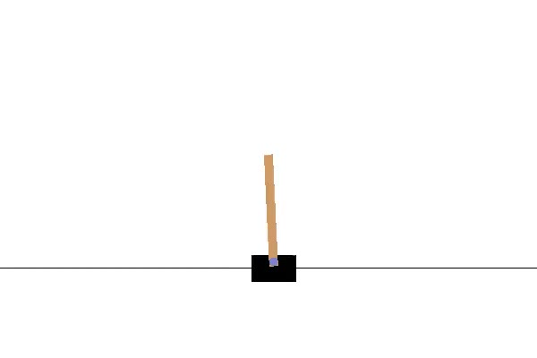

# Playing CartPole with Policy Gradient

In this repository, I implement policy gradient to solve the arguably simples setting from `OpenAI gym`: the `cart_pole-v0`. It shouldn't be called deep reinforcement learning, as the model I use is not deep in any sense. It assumes as input a tensor of `4` numbers and uses a softmax classification to model the probabilities of whether one should push the cart to the `left` or to the `right



Despite the model's simplicty, it consistently survives `200` steps on `99%` of the test scenes, hence considered successful by the game's standard.

For an excellent tutorial on Policy Gradient, please refer to David Silver's [lecture](http://www0.cs.ucl.ac.uk/staff/D.Silver/web/Teaching_files/pg.pdf).

## Installation ##
The dependencies are `OpenAI gym` and `Tensorflow`. I strongly recommend that you follow their installation guides:
* **Tensorflow**: [getting started](https://www.tensorflow.org/versions/r0.10/get_started/os_setup.html#pip-installation)
* **OpenAI Gym**: [docs](https://gym.openai.com/docs)

## Usage ##
I included a file `run.sh`` which describes how to run the code. If you wish to run it manually, here's how:
```
# remove the output folder so that the model trains from scratch
rm -rf output
python main.py --eps_length 500 --train_eps 2000 --test_eps 50 --lr 0.01 --lr_dec 0.5 --render
```
